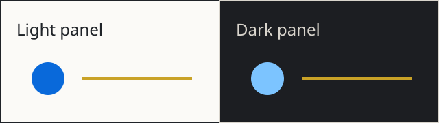

# DT44 rendering fixture

This file contains fictional test material. Use a disposable copy in an approved test database with sync, AI processing, and pipeline automation disabled. Do not import it into Lorebook or either inbox.

## Prose and inline formatting

This paragraph contains **bold text**, *italic text*, ***combined emphasis***, ~~deleted text~~, and an escaped asterisk \*. The labels **Area**² and *Volume*³ test emphasis followed by superscript characters. H<sub>2</sub>O and x<sup>2</sup> provide HTML subscript and superscript controls.

The literal emoji 📚 and the GitHub-style shortcode :books: test native emoji rendering.

This longer paragraph should remain readable when the preview pane becomes narrow. Words should wrap without disappearing behind the pane edge. Changing the color theme should preserve both the text and its selection, and returning to the original theme should not modify the Markdown source.

## Timeline and nested lists

- 9:05am: This is a fictional manual timeline entry.
- 9:30am: 📅 [Fixture meeting](#tables)
  - 👤 Fixture Person is a fictional attendee.
  - 📝 [Fixture attachment](#images) is a local section link.
  - This manually written detail must stay under the meeting.
    - This second-level detail must remain nested.
- 10:10am: 🔗 [Fixture reference](https://example.invalid/reference) is deliberately unreachable.
- 📔 This is a fictional pinned journal entry.

1. This is the first ordered item.
2. This is the second ordered item.
   - This unordered child belongs to the second item.
3. This is the third ordered item.

## Action Items

- [ ] Review the fictional checklist.
  This continuation belongs to the same task and should not appear beneath the checkbox itself.
  - [ ] Check the nested fictional task.
- [x] Preserve the completed task's checked state.
- [ ] Keep `~/fixture/input.md` unchanged inside inline code.

## Tables

| Item | Quantity | Status |
| :--- | ---: | :---: |
| Fixture alpha | 12 | Pending |
| Fixture beta | 24 | Complete |
| Fixture pipe | 36 | `left\|right` |

| Long item name | Details | Inline code | Quantity | Expected ownership | Outcome |
| :--- | :--- | :--- | ---: | :--- | :--- |
| Fictional wide-table control | This cell contains enough text to test wrapping within the cell rather than clipping the page. | `fixture_identifier_0123456789_ABCDEFGHIJKLMNOPQRSTUVWXYZ` | 12345 | The first row owns this text. | This final column must remain reachable. |
| Second fictional row | This row must remain separate after an edit to the first row. | `another_fixture_identifier` | 67890 | The second row owns this text. | This final cell must remain reachable. |

## Callouts and quotations

> [!NOTE]
> This note should have a readable title and body.

> [!TIP]
> This tip tests its own accent color.

> [!IMPORTANT]
> This important callout should remain distinct in both appearances.

> [!WARNING]
> This warning has a second paragraph.
>
> The paragraph must remain inside the same callout.

> [!CAUTION]
> This caution should remain readable without relying on color alone.

> This is an ordinary quotation, not a callout.
>
> - This list belongs inside the quotation.
> - This second item must not escape the quotation.

## Code and long lines

Inline code includes `a < b`, `a & b`, and `fixture("literal")`. Keyboard-style HTML uses <kbd>Command</kbd> and <kbd>S</kbd>.

```python
fixture = {"name": "Fixture alpha", "quantity": 12}
message = "This deliberately long fictional code line tests whether the right edge remains accessible in a narrow desktop preview and whether copying a visually wrapped line still produces the original single source line without added newline characters."
print(fixture["name"], message)
```

```text
fixture_0123456789ABCDEFGHIJKLMNOPQRSTUVWXYZ_0123456789ABCDEFGHIJKLMNOPQRSTUVWXYZ_0123456789ABCDEFGHIJKLMNOPQRSTUVWXYZ_0123456789ABCDEFGHIJKLMNOPQRSTUVWXYZ_0123456789ABCDEFGHIJKLMNOPQRSTUVWXYZ
# This line is literal code, not a document heading.
```

## Tilde controls

The approximate value is ~12 units. The explicit escaped form is \~12 units. These are paired single tildes: ~literal words~. These are paired double tildes: ~~deleted words~~.

Inline code must preserve `~/fixture/input.md`, `~mask`, and `left~right` literally.

```sh
printf '%s\n' ~/fixture/input.md
printf '%s\n' 'left~right'
```

~~~text
A tilde fence must remain a fence.
The path ~/fixture/input.md is literal text inside the fence.
~~~

## Math

Inline math uses $x^2 + y^2 = z^2$ beside ordinary text.

$$
\sum_{i=1}^{3} i^2 = 14
$$

$$
\begin{bmatrix}
1 & 2 \\
3 & 4
\end{bmatrix}
$$

## Links and footnotes

[Return to the tables](#tables) is a local section link. [The reference-style link][fixture-reference] uses a definition below. `x-devonthink-item://<fixture-uuid>` is intentionally plain code, not a live item link.

The unresolved WikiLink [[DT44 Fixture Companion]] tests source preservation. Do not activate it or create a target during the rendering baseline.

This statement has a footnote.[^fixture] This second statement reuses it.[^fixture]

## Images



The local SVG has no scripts or external resource references. If the renderer cannot resolve the relative asset path, record an asset-resolution failure separately from theme behavior.

## Extended syntax probes

These probes test syntax that the stylesheet anticipates. Literal rendering is an observation, not proof that 4.4 promises support for every extension.

Fixture term
: This is a definition-list probe.

PKM is the abbreviation probe.

*[PKM]: Personal knowledge management

This is a fictional citation probe.[#fixture-citation]

[#fixture-citation]: Fixture Author. Fictional rendering reference. 2030.

This sentence contains {++added words++}, {--removed words--}, {==highlighted words==}, {>>a fixture annotation<<}, and {~~old wording~>new wording~~}.

### Semantic HTML controls

<dl><dt>Fixture term</dt><dd>This HTML definition is the CSS control.</dd></dl>

<abbr title="Personal knowledge management">PKM</abbr> is the HTML abbreviation control. <cite>Fictional rendering reference</cite> is the citation control.

This sentence contains <ins>added words</ins>, <del>removed words</del>, and <mark>highlighted words</mark> as HTML controls.

## Entity-style fields

**Role:** Fixture reviewer
**City:** Fixture City
**Partner:** No fixture value is assigned.
**Kids:** No fixture value is assigned.
**How we met:** This is synthetic template content.

### Biographical Log

- 2030-01-02
  - This fictional fact belongs to the dated parent bullet.
  - This second fictional fact must retain its indentation.

## Final source sentinel

This final sentence must survive every preview change, edit, save, and source export.

[fixture-reference]: https://example.invalid/fixture-reference "Fictional reference"

[^fixture]: This fictional footnote includes **emphasis** and `literal_code`.
