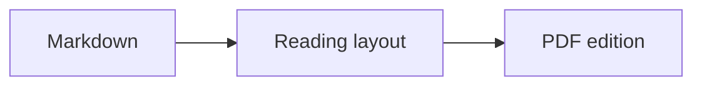
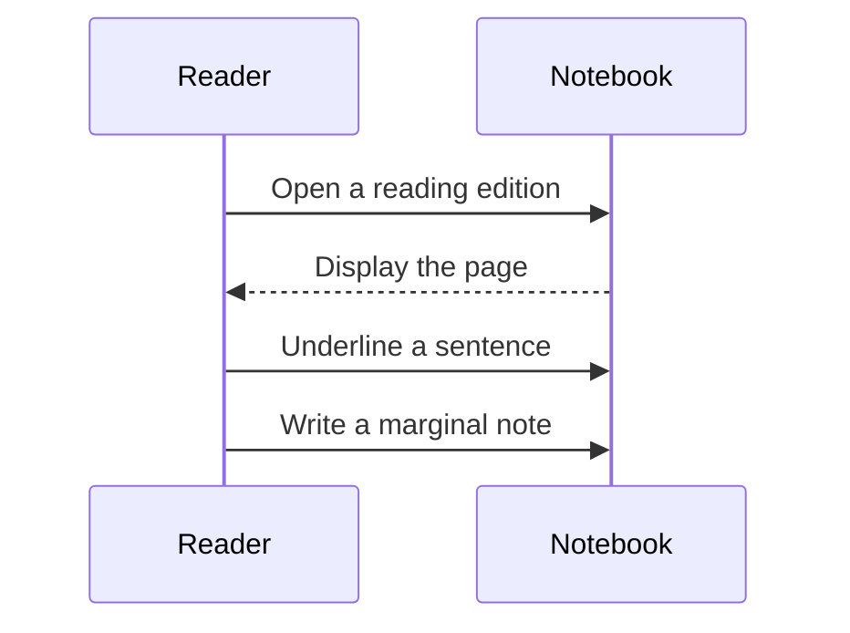

# Reading diagrams

## A short workflow

The diagram should keep its labels, arrows, and white background without entering the annotation margin.

## An exchange between two participants

Each diagram renders locally. The source Markdown remains unchanged.
